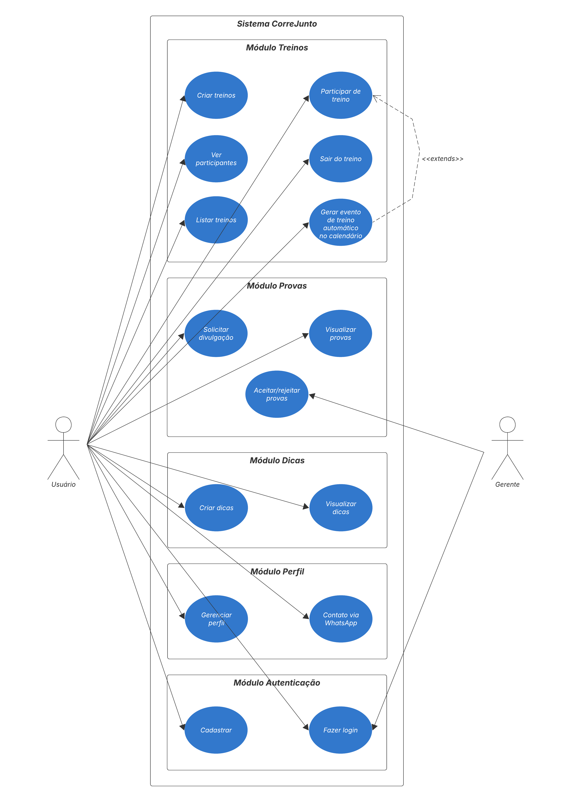

# Requisitos — CorreJunto

# Requisitos Funcionais

## RF01 — Cadastro de usuários
O sistema deve permitir que usuários realizem cadastro na plataforma.

## RF02 — Autenticação de usuários
O sistema deve permitir login de usuários cadastrados.

## RF03 — Criação de treinos
O sistema deve permitir que usuários criem treinos em grupo.

## RF04 — Participação em treinos
O sistema deve permitir entrada e saída de participantes nos treinos.

## RF05 — Visualização de participantes
O sistema deve exibir a lista de participantes de cada treino.

## RF06 — Divulgação de provas
O sistema deve permitir solicitação de divulgação de provas.

## RF07 — Aprovação de provas
O sistema deve permitir que gerentes aprovem ou recusem provas.

## RF08 — Perfil do usuário
O sistema deve exibir informações públicas do corredor.

## RF09 — Visualização de dicas
O sistema deve permitir acesso às dicas de corrida cadastradas.

## RF10 — Integração com calendário
O sistema deve permitir gerar eventos de calendário para treinos confirmados.

---

# Requisitos Não Funcionais

## RNF01 — Responsividade
O sistema deve funcionar em dispositivos móveis e computadores.

## RNF02 — Usabilidade
A interface deve ser simples e intuitiva para os usuários.

## RNF03 — Disponibilidade
O sistema deverá estar acessível via navegador web.

## RNF04 — Desempenho
As páginas devem carregar em tempo aceitável para o usuário.

## RNF05 — Segurança
O sistema deve exigir autenticação para ações privadas.

## RNF06 — Organização das informações
Os conteúdos do sistema devem estar organizados de maneira clara e acessível.

## RNF07 — Compatibilidade
O sistema deve funcionar nos principais navegadores modernos.

# Histórias de Usuário

## Módulo Treinos

**US01 — Criar treino**
> Como usuário, quero criar um treino com data, horário, local, tipo e pace médio, para que outros corredores possam encontrá-lo e participar.

Critérios de aceitação:
- O usuário deve estar autenticado para criar um treino
- Os campos data, horário, local e tipo de treino são obrigatórios
- O treino criado deve aparecer na listagem geral

---

**US02 — Participar de treino**
> Como usuário, quero me inscrever em um treino existente, para que eu possa me organizar e treinar com outras pessoas.

Critérios de aceitação:
- O usuário deve estar autenticado
- O botão "Participar" deve ser exibido apenas para treinos em que o usuário ainda não está inscrito
- Após participar, o usuário deve aparecer na lista de participantes

---

**US03 — Sair de treino**
> Como usuário, quero cancelar minha participação em um treino, para que minha vaga fique disponível para outros.

Critérios de aceitação:
- O botão "Sair do treino" deve ser exibido apenas para treinos em que o usuário já está inscrito
- Após sair, o usuário deve ser removido da lista de participantes

---

**US04 — Listar treinos**
> Como usuário, quero visualizar os treinos disponíveis, para que eu possa escolher em qual participar.

Critérios de aceitação:
- A listagem deve exibir data, horário, local, tipo e pace de cada treino
- Deve ser possível visualizar a lista de participantes de cada treino

---

**US05 — Gerar evento no calendário**
> Como usuário, quero gerar um evento no meu calendário ao confirmar presença em um treino, para que eu não esqueça a atividade.

Critérios de aceitação:
- O sistema deve oferecer a opção de exportar um arquivo `.ics` ou abrir o Google Calendar
- A funcionalidade é opcional e acionada pelo usuário após confirmar presença

---

## Módulo Provas

**US06 — Solicitar divulgação de prova**
> Como usuário, quero solicitar a divulgação de uma prova de corrida, para que outros corredores fiquem sabendo do evento.

Critérios de aceitação:
- O usuário deve estar autenticado
- A solicitação deve incluir: data da prova, data limite de inscrição, valores, percurso e distância
- A prova só aparece publicamente após aprovação do gerente

---

**US07 — Visualizar provas**
> Como usuário, quero visualizar as provas divulgadas, para que eu possa me planejar para participar.

Critérios de aceitação:
- Apenas provas aprovadas pelo gerente devem ser exibidas
- As informações exibidas devem incluir data, distância, percurso e valores

---

**US08 — Aprovar ou recusar prova**
> Como gerente, quero aprovar ou recusar solicitações de divulgação de provas, para que apenas eventos válidos sejam publicados.

Critérios de aceitação:
- O gerente deve ter acesso a um painel com as solicitações pendentes
- Ao aprovar, a prova passa a ser exibida publicamente
- Ao recusar, a prova não é publicada

---

## Módulo Dicas

**US09 — Criar dica**
> Como usuário, quero compartilhar dicas sobre corrida, para que outros corredores se beneficiem da minha experiência.

Critérios de aceitação:
- O usuário deve estar autenticado
- A dica deve ter título e conteúdo

---

**US10 — Visualizar dicas**
> Como usuário, quero ler dicas de outros corredores, para que eu possa melhorar minha performance e conhecimento.

Critérios de aceitação:
- As dicas devem ser acessíveis sem necessidade de autenticação
- As dicas devem ser exibidas em ordem cronológica inversa

---

## Módulo Perfil

**US11 — Gerenciar perfil**
> Como usuário, quero editar meu perfil com foto, bio e nível de corrida, para que outros corredores me conheçam melhor.

Critérios de aceitação:
- O usuário deve estar autenticado
- Os campos editáveis são: foto, bio e nível de corrida
- O perfil deve exibir a quantidade de treinos criados pelo usuário

---

**US12 — Contato via WhatsApp**
> Como usuário, quero acessar o contato de outro corredor via WhatsApp diretamente pelo perfil, para que eu possa me comunicar externamente.

Critérios de aceitação:
- O link de WhatsApp deve abrir o aplicativo com o número pré-preenchido
- O número de telefone é opcional no cadastro do usuário

---

## Autenticação

**US13 — Cadastrar-se**
> Como visitante, quero criar uma conta no sistema, para que eu possa acessar as funcionalidades do CorreJunto.

Critérios de aceitação:
- Os campos obrigatórios são: nome, e-mail e senha
- O e-mail deve ser único no sistema
- A senha deve ter no mínimo 8 caracteres

---

**US14 — Fazer login**
> Como usuário cadastrado, quero entrar na minha conta, para que eu possa utilizar o sistema.

Critérios de aceitação:
- O login deve ser feito com e-mail e senha
- Credenciais inválidas devem exibir mensagem de erro
- Após o login, o usuário é redirecionado para a página inicial

---

# Diagrama de Casos de Uso

# Requisitos do Sistema — CorreJunto

# Requisitos Funcionais

## RF01 — Cadastro de usuários
O sistema deve permitir que usuários realizem cadastro na plataforma.

## RF02 — Autenticação de usuários
O sistema deve permitir login de usuários cadastrados.

## RF03 — Criação de treinos
O sistema deve permitir que usuários criem treinos em grupo.

## RF04 — Participação em treinos
O sistema deve permitir entrada e saída de participantes nos treinos.

## RF05 — Visualização de participantes
O sistema deve exibir a lista de participantes de cada treino.

## RF06 — Divulgação de provas
O sistema deve permitir solicitação de divulgação de provas.

## RF07 — Aprovação de provas
O sistema deve permitir que gerentes aprovem ou recusem provas.

## RF08 — Perfil do usuário
O sistema deve exibir informações públicas do corredor.

## RF09 — Visualização de dicas
O sistema deve permitir acesso às dicas de corrida cadastradas.

## RF10 — Integração com calendário
O sistema deve permitir gerar eventos de calendário para treinos confirmados.

---

# Requisitos Não Funcionais

## RNF01 — Responsividade
O sistema deve funcionar em dispositivos móveis e computadores.

## RNF02 — Usabilidade
A interface deve ser simples e intuitiva para os usuários.

## RNF03 — Disponibilidade
O sistema deverá estar acessível via navegador web.

## RNF04 — Desempenho
As páginas devem carregar em tempo aceitável para o usuário.

## RNF05 — Segurança
O sistema deve exigir autenticação para ações privadas.

## RNF06 — Organização das informações
Os conteúdos do sistema devem estar organizados de maneira clara e acessível.

## RNF07 — Compatibilidade
O sistema deve funcionar nos principais navegadores modernos.
